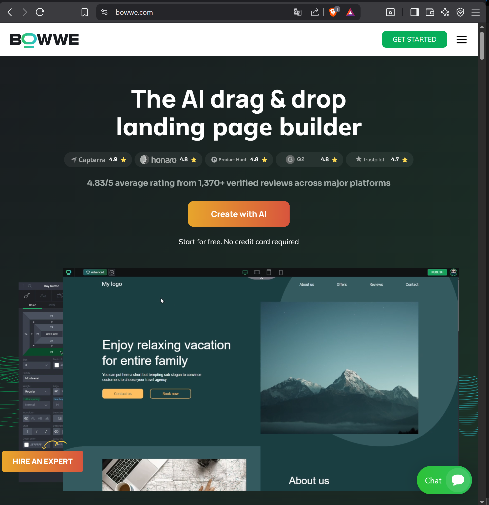
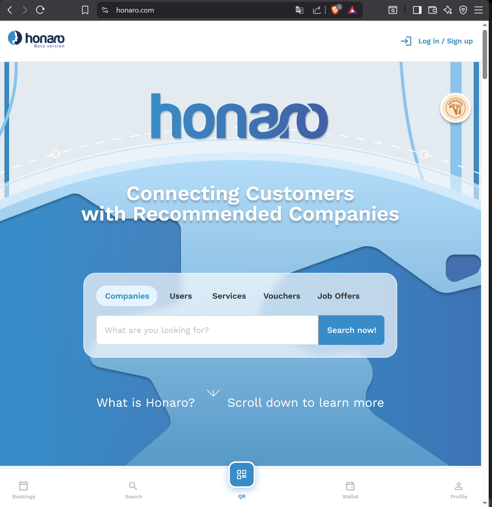

**Product Owner · Business Analyst · Data Analyst**
Ulan Software, November 2022 - present

---

I shipped a full e-commerce module in a SaaS website builder - 600+ tasks, 1.5 years, live in production. I set up our analytics stack from scratch and found that 6 logins increases purchase probability 8x - that finding changed how we build onboarding. I'm the only person writing specifications for a 15-person dev team across 4 products.

---

## Products

**[BOWWE](https://bowwe.com)** - AI website and e-commerce builder

**[Honaro](https://honaro.com)** - Service marketplace

**TaskRabbit integration** - Cross-company e-commerce integration coordinated across 3 organizations

**Proptech app** - Rental property management platform, scoping phase

---

## Skills

| | |
|---|---|
| **Analytics** | SQL, BigQuery, GA4, Google Data Studio |
| **Modelling** | UML, BPMN |
| **Product** | Jira, Confluence, GitLab, Figma |
| **Methods** | RICE, user research, UAT, sprint management |

---

## Case studies

- 🧭 **[Product Owner](./product-owner/)**
- 🔍 **[Business Analyst](./business-analyst/)**
- 📊 **[Data Analyst](./data-analyst/)**

---

**Email:** wiktorkrol@gmail.com · **LinkedIn:** [linkedin.com/in/wiktor-krol](https://pl.linkedin.com/in/wiktor-krol)

*Projects at Ulan Software. Client names and confidential metrics generalized where required.*
